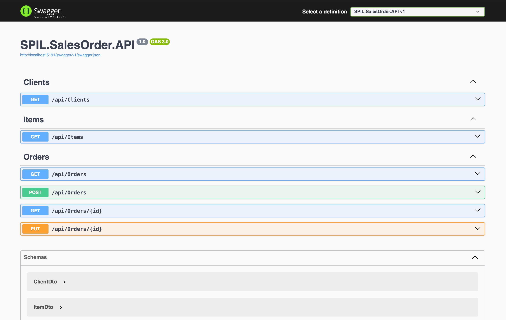

# API Documentation

This document outlines the RESTful API endpoints exposed by the SPIL Sales Order Management .NET 8 Web API.

**Base URL:** `/api`

During local development, the API base URL is determined by the ASP.NET Core launch profile (for example, `https://localhost:7123/api`).

## 📸 Swagger Overview

The backend provides an interactive OpenAPI (Swagger) interface for exploring, testing, and validating all available REST API endpoints during development.



---

## 👥 Clients

### `GET /Clients`

Fetches a list of all available clients. Used to populate the Customer Name dropdown on the Sales Order screen.

- **Method:** GET
- **Success Response:** `200 OK`
- **Response Example:**

```json
[
  {
    "id": 1,
    "customerName": "Kasun Sampath"
  },
  {
    "id": 2,
    "customerName": "Nimal Perera"
  }
]
```

---

## 📦 Items

### `GET /Items`

Fetches a list of all available products/items. Used to populate the Item Code and Description dropdowns in the Sales Order data grid.

- **Method:** GET
- **Success Response:** `200 OK`
- **Response Example:**

```json
[
  {
    "id": 1,
    "itemCode": "ITM-001",
    "description": "Enterprise Server Rack",
    "defaultPrice": 1200.0,
    "defaultTaxRate": 15.0
  }
]
```

---

## 📝 Orders

### `GET /Orders`

Fetches a summary list of all sales orders. Used to populate the data grid on the Home Dashboard.

- **Method:** GET
- **Success Response:** `200 OK`
- **Response Example:**

```json
[
  {
    "id": 1,
    "invoiceNo": "INV-1001",
    "invoiceDate": "2026-07-04",
    "customerName": "Kasun Sampath",
    "totalIncl": 1380.0
  }
]
```

---

### `GET /Orders/{id}`

Fetches the full details of a specific sales order, including its associated line items. Used to load an existing order into the Sales Order form for editing.

- **Method:** GET
- **Parameters:** `id` (integer, required)
- **Success Response:** `200 OK`
- **Error Responses:** `404 Not Found` (If the order ID does not exist)
- **Response Example:**

```json
{
  "id": 1,
  "clientId": 1,
  "invoiceNo": "INV-1001",
  "invoiceDate": "2026-07-04",
  "referenceNo": "PO-9921",
  "address1": "No 15, loka mawatha",
  "address2": "Suite 400",
  "suburb": "Colombo",
  "state": "WP",
  "postCode": "10200",
  "note": "Deliver to rear loading dock.",
  "totalExcl": 1200.0,
  "totalTax": 180.0,
  "totalIncl": 1380.0,
  "orderItems": [
    {
      "itemId": 1,
      "quantity": 1,
      "defaultPrice": 1200.0,
      "defaultTaxRate": 15.0,
      "note": "Standard configuration"
    }
  ]
}
```

---

### `POST /Orders`

Creates a new sales order. The backend recalculates all financial totals based on the provided item quantities before persisting the order. Any client-side totals are ignored to ensure data integrity.

- **Method:** POST
- **Headers:** `Content-Type: application/json`
- **Success Response:** `201 Created`
- **Error Responses:** `400 Bad Request` (Validation failure)
- **Request Payload Example (OrderInputDto):**

```json
{
  "clientId": 1,
  "invoiceNo": "INV-1002",
  "invoiceDate": "2026-07-04",
  "referenceNo": "PO-1122",
  "address1": "No 13, bank's road",
  "address2": "",
  "suburb": "Kirulapana",
  "state": "WP",
  "postCode": "10001",
  "note": "Urgent delivery",
  "orderItems": [
    {
      "itemId": 1,
      "quantity": 2,
      "defaultPrice": 1200.0,
      "defaultTaxRate": 15.0,
      "note": ""
    }
  ]
}
```

---

### `PUT /Orders/{id}`

Updates an existing sales order. For this technical assessment, updating an order replaces the existing `orderItems` collection with the items supplied in the request.

- **Method:** PUT
- **Headers:** `Content-Type: application/json`
- **Parameters:** `id` (integer, required)
- **Success Response:** `200 OK`
- **Error Responses:** `400 Bad Request` (ID mismatch or validation failure), `404 Not Found`
- **Request Payload Example (OrderInputDto):**

```json
{
  "id": 1,
  "clientId": 1,
  "invoiceNo": "INV-1001",
  "invoiceDate": "2026-07-04",
  "referenceNo": "PO-9921",
  "address1": "No 37/2, water park",
  "address2": "Suite 400",
  "suburb": "Nugegoda",
  "state": "WP",
  "postCode": "10001",
  "note": "Updated note: Call before delivery.",
  "orderItems": [
    {
      "itemId": 1,
      "quantity": 3,
      "defaultPrice": 1200.0,
      "defaultTaxRate": 15.0,
      "note": "Increased quantity"
    }
  ]
}
```

---

## ✅ Validation Rules

The API validates incoming requests using .NET Data Annotations. Validation includes:

- **Client ID** is required.
- **Invoice Number** is required.
- At least one **Order Item** must be provided.
- **Quantity** must be greater than zero.
- **Default Price** cannot be negative.
- **Default Tax Rate** must be between 0 and 100.

---

## ⚙️ Business Rules

- **Data Integrity:** Financial totals (exclusive, tax, and inclusive amounts) are calculated by the backend before persistence. Client-side totals are ignored to ensure data integrity.
- **Reference Data:** Clients and Items are seeded directly via Entity Framework Core to facilitate immediate testing.
- **Update Strategy:** For this technical assessment, updating an order replaces the existing `orderItems` collection with the items supplied in the request.

---

## 🌐 HTTP Status Codes

| Status              | Description                                    |
| ------------------- | ---------------------------------------------- |
| **200 OK**          | Request completed successfully.                |
| **201 Created**     | Resource created successfully (Used for POST). |
| **400 Bad Request** | Validation failed.                             |
| **404 Not Found**   | Requested resource could not be located.       |
